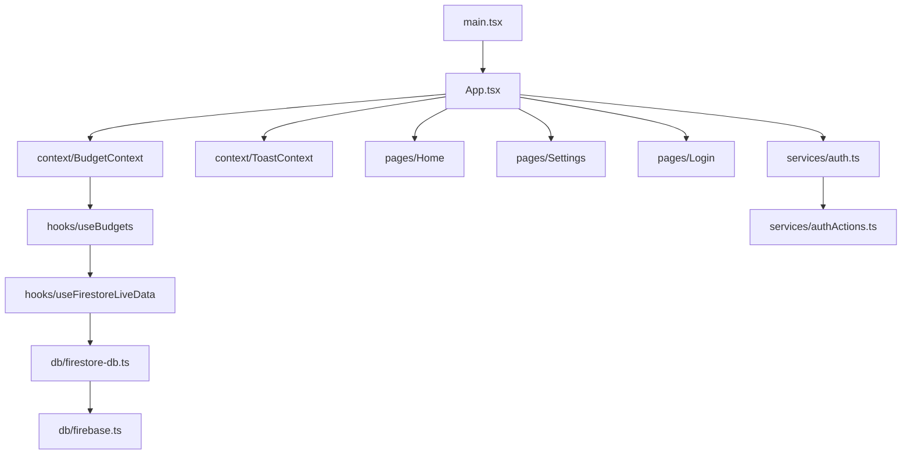

# Fire Budget Tracker Forecaster

> Offline-first recurring budget tracker. Users log budgets by frequency (weekly/monthly/yearly), get workday-aware daily allowance calculations, with real-time Firestore sync and multi-currency/i18n support.

## Tech Map



**Stack:** React 19 · Firebase 12 (Auth + Firestore) · Vite · Tailwind CSS v4 · TypeScript · Vitest · pnpm

## Commands

```sh
pnpm dev                                              # Dev server → localhost:3000
pnpm build                                            # Production build (dist/)
pnpm lint                                             # ESLint (TypeScript rules)
pnpm test                                             # Vitest (jsdom environment)
pnpm test:coverage                                    # v8 coverage → coverage/
pnpm test src/__tests__/components/BudgetCard.test.tsx  # File-scoped test run
```

## Environment

Copy `.env.example` → `.env`. Required: all `VITE_FIREBASE_*` keys + `GEMINI_API_KEY`.
Optional: `VITE_USE_FIRESTORE_EMULATOR=true` for local dev.

## Routing

**No React Router.** Navigation is `activeTab` state in `src/App.tsx`. Auth gate is handled via `initAuthObserver()` → conditional render of `<Login>` vs dashboard.

## Progressive Disclosure

| Situation | Read |
|---|---|
| Auth, sessions, OAuth errors | [agent_docs/AUTH_FLOW.md](agent_docs/AUTH_FLOW.md) |
| Firestore schema, offline sync, security rules | [agent_docs/DATA_LAYER.md](agent_docs/DATA_LAYER.md) |
| Global state, context, localStorage preferences | [agent_docs/STATE_MANAGEMENT.md](agent_docs/STATE_MANAGEMENT.md) |
| Translation keys, currency formatting | [agent_docs/I18N_CURRENCY.md](agent_docs/I18N_CURRENCY.md) |
| Forbidden patterns and pitfalls | [agent_docs/ANTI_PATTERNS.md](agent_docs/ANTI_PATTERNS.md) |

## Non-Negotiable Rules

1. **Notifications:** Use `useToast()` — never `alert()` or `window.confirm()`
2. **Logging:** Use `getLogger('Module')` from `src/utils/logger.ts` — never `console.log()`
3. **Firebase access:** Only via `src/db/` and `src/services/` — never import firebase directly in components
4. **Styling:** Use `cn()` from `src/utils/cn.ts` for conditional classes — never inline `style={{}}`
