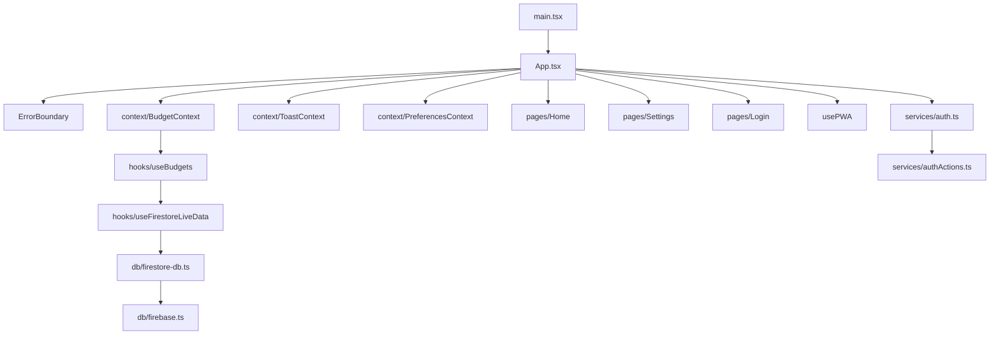

# Fire Budget Tracker Forecaster

This file provides guidance to Claude Code (claude.ai/code) when working with code in this repository.

> Offline-first recurring budget tracker with workday-aware daily allowance calculations, real-time Firestore sync, and a scalable localized UI built for multi-currency and multi-language audiences.

## The Token Contract

> **Before writing any color, spacing, or font value:**
>
> 1. Check `src/index.css @theme` — if a semantic token exists, use its Tailwind class (`bg-health-bg`, not `bg-[#F2F2F7]`).
> 2. Check `agent_docs/DESIGN_TOKENS.md` — if a convention exists (border-radius, type scale), follow it.
> 3. If neither covers the case, **define the token in `src/index.css @theme` first**, then document it in `DESIGN_TOKENS.md`, then use it.

## Tech Map



**Stack:** React 19 · Firebase 12 (Auth + Firestore) · Vite · Tailwind CSS v4 · TypeScript · Vitest · pnpm

## Commands

### Development & Build
```sh
pnpm dev                                              # Dev server → localhost:3000
pnpm build                                            # Production build (dist/)
pnpm preview                                          # Preview prod build locally
pnpm clean                                            # Remove dist/ directory
```

### Linting & Type Safety

```sh
pnpm lint                                             # ESLint check (console.log, unused vars, any types)
pnpm lint:fix                                         # ESLint auto-fix
pnpm type-check                                       # TypeScript check (no emit)
```

### Testing

```sh
pnpm test                                             # Vitest watch mode (jsdom environment)
pnpm test:run                                         # Vitest single run (CI mode)
pnpm test:ui                                          # Vitest UI dashboard (browser-based)
pnpm test:coverage                                    # v8 coverage report → coverage/
pnpm test src/__tests__/components/BudgetCard.test.tsx  # File-scoped test run
```

### Manual Quality Checks

```sh
# Token crime check — hardcoded hex or rgb values in source
grep -rn "#[0-9a-fA-F]\{3,6\}\|rgb(" src/ --include="*.tsx" --include="*.ts"

# i18n crime check — directional layout classes that break RTL
grep -rn "text-left\|text-right\|\" ml-\|\" mr-\|\" pl-\|\" pr-" src/ --include="*.tsx"

# Hardcoded user-facing strings — quotes not preceded by t. or className
grep -rn '>[A-Z][a-z]' src/components src/pages --include="*.tsx" | grep -v "t\."
```

## Code Splitting & Lazy Loading

Pages and Firestore are strategically lazy-loaded to minimize initial bundle size:

- **Firestore chunk (`firestore-chunk`)** — Loaded only after auth succeeds, reduces auth-flow bundle
- **Settings page** — Lazy via `React.lazy()` + `<Suspense>`, wrapped in `<ChunkErrorBoundary>`
- **Home page** — Lazy for deep-link support, wrapped in `<ChunkErrorBoundary>`

**Chunk error handling:** Wrap `<Suspense>` with `<ChunkErrorBoundary>` to gracefully handle network failures during chunk load. See `src/components/ChunkErrorBoundary.tsx`.

## Error Boundaries

Two layers of error recovery:

1. **`<ErrorBoundary>`** — Top-level, catches render errors in child components. Prevents entire app crash.
   - Does NOT catch event handlers, async code, or server errors
   - For those, use `try-catch` in handlers or service layers

2. **`<ChunkErrorBoundary>`** — Wraps `<Suspense>` to handle lazy-chunk network failures.
   - Catches stale chunk references, offline scenarios, CDN outages
   - Provides refresh button to retry chunk load

Place these at logical fallback boundaries, not around every component.

## PWA & Offline Support

- **Manifest:** Configured in `vite.config.ts` — app name, icons, theme color
- **Service Worker:** `vite-plugin-pwa` with Workbox; caches static assets + Google Fonts
- **Update Banner:** `<PWAUpdateBanner>` prompts on new service worker activation
- **Environment:** `VITE_PWA_DEV=false` disables PWA in dev (faster HMR); default is enabled
- **Backup/Import:** `src/utils/backupUtils.ts` handles GZIP compression for data portability

## Environment

Copy `.env.example` → `.env`. 

**Required:**
- All `VITE_FIREBASE_*` keys (auth domain, project ID, API key, etc.)
- `GEMINI_API_KEY` (for future AI features)

**Optional:**
- `VITE_USE_FIRESTORE_EMULATOR=true` for local dev against Firestore emulator
- `VITE_PWA_DEV=false` to disable PWA in development

## Routing

**No React Router.** Navigation is `activeTab` state in `src/App.tsx`. Auth gate is handled via `initAuthObserver()` → conditional render of `<Login>` vs dashboard.

**Deep linking:** Home page is lazy-loaded and recovers from 404-style deep links gracefully.

## State Management

| Context | Purpose |
| --- | --- |
| `BudgetContext` | Active budgets, categories, spending data (Firestore-synced) |
| `ToastContext` | Toast notifications (`useToast()` hook) |
| `PreferencesContext` | User preferences (language, currency) stored in localStorage |

**Firestore sync:** `useBudgets()` → `useFirestoreLiveData()` → Firestore listeners. On offline, reads from localStorage cache.

## Progressive Disclosure

| Situation | Read |
| --- | --- |
| Auth, sessions, OAuth errors | [agent_docs/AUTH_FLOW.md](agent_docs/AUTH_FLOW.md) |
| Firestore schema, offline sync, security rules | [agent_docs/DATA_LAYER.md](agent_docs/DATA_LAYER.md) |
| Global state, context, localStorage preferences | [agent_docs/STATE_MANAGEMENT.md](agent_docs/STATE_MANAGEMENT.md) |
| Translation keys, RTL safety, currency formatting | [agent_docs/I18N_ARCHITECTURE.md](agent_docs/I18N_ARCHITECTURE.md) |
| Design tokens, color palette, type scale, spacing | [agent_docs/DESIGN_TOKENS.md](agent_docs/DESIGN_TOKENS.md) |
| Forbidden patterns and pitfalls | [agent_docs/ANTI_PATTERNS.md](agent_docs/ANTI_PATTERNS.md) |
| Currency formatting & locales | [agent_docs/I18N_CURRENCY.md](agent_docs/I18N_CURRENCY.md) |

## Non-Negotiable Rules

1. **Notifications:** Use `useToast()` — never `alert()` or `window.confirm()`
2. **Logging:** Use `getLogger('Module')` from `src/utils/logger.ts` — never `console.log()`
3. **Firebase access:** Only via `src/db/` and `src/services/` — never import firebase directly in components
4. **Styling:** Use `cn()` from `src/utils/cn.ts` for conditional classes — never inline `style={{}}` except for calculated `width`/`height` percentages in progress bars
5. **Tokens:** Never write a raw hex, rgb, or hardcoded pixel color — resolve from `src/index.css @theme` first (see The Token Contract above)
6. **i18n:** Every user-facing string lives in `src/utils/i18n.ts` — use `t.keyName`; never hardcode copy in components
7. **Error handling:** Wrap lazy `<Suspense>` boundaries with `<ChunkErrorBoundary>` to catch network/chunk failures
