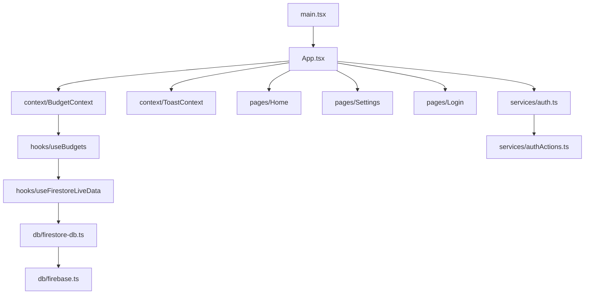

# Fire Budget Tracker Forecaster

> Offline-first recurring budget tracker with workday-aware daily allowance calculations, real-time Firestore sync, and a scalable localized UI built for multi-currency and multi-language audiences.

## The Token Contract

> **Before writing any color, spacing, or font value:**
>
> 1. Check `src/index.css @theme` — if a semantic token exists, use its Tailwind class (`bg-health-bg`, not `bg-[#F2F2F7]`).
> 2. Check `agent_docs/DESIGN_TOKENS.md` — if a convention exists (border-radius, type scale), follow it.
> 3. If neither covers the case, **define the token in `src/index.css @theme` first**, then document it in `DESIGN_TOKENS.md`, then use it.

## Tech Map



**Stack:** React 19 · Firebase 12 (Auth + Firestore) · Vite · Tailwind CSS v4 · TypeScript · Vitest · pnpm

## Commands

```sh
pnpm dev                                              # Dev server → localhost:3000
pnpm build                                            # Production build (dist/)
pnpm lint                                             # ESLint — catches console.log, unused vars, any types
pnpm test                                             # Vitest (jsdom environment)
pnpm test:coverage                                    # v8 coverage → coverage/
pnpm test src/__tests__/components/BudgetCard.test.tsx  # File-scoped test run
```

**Style & i18n checks (no separate script — use grep as fast-pass):**

```sh
# Token crime check — hardcoded hex or rgb values in source
grep -rn "#[0-9a-fA-F]\{3,6\}\|rgb(" src/ --include="*.tsx" --include="*.ts"

# i18n crime check — directional layout classes that break RTL
grep -rn "text-left\|text-right\|\" ml-\|\" mr-\|\" pl-\|\" pr-" src/ --include="*.tsx"

# Hardcoded user-facing strings — quotes not preceded by t. or className
grep -rn '>[A-Z][a-z]' src/components src/pages --include="*.tsx" | grep -v "t\."
```

## Environment

Copy `.env.example` → `.env`. Required: all `VITE_FIREBASE_*` keys + `GEMINI_API_KEY`.
Optional: `VITE_USE_FIRESTORE_EMULATOR=true` for local dev.

## Routing

**No React Router.** Navigation is `activeTab` state in `src/App.tsx`. Auth gate is handled via `initAuthObserver()` → conditional render of `<Login>` vs dashboard.

## Progressive Disclosure

| Situation | Read |
| --- | --- |
| Auth, sessions, OAuth errors | [agent_docs/AUTH_FLOW.md](agent_docs/AUTH_FLOW.md) |
| Firestore schema, offline sync, security rules | [agent_docs/DATA_LAYER.md](agent_docs/DATA_LAYER.md) |
| Global state, context, localStorage preferences | [agent_docs/STATE_MANAGEMENT.md](agent_docs/STATE_MANAGEMENT.md) |
| Translation keys, RTL safety, currency formatting | [agent_docs/I18N_ARCHITECTURE.md](agent_docs/I18N_ARCHITECTURE.md) |
| Design tokens, color palette, type scale, spacing | [agent_docs/DESIGN_TOKENS.md](agent_docs/DESIGN_TOKENS.md) |
| Forbidden patterns and pitfalls | [agent_docs/ANTI_PATTERNS.md](agent_docs/ANTI_PATTERNS.md) |

## Non-Negotiable Rules

1. **Notifications:** Use `useToast()` — never `alert()` or `window.confirm()`
2. **Logging:** Use `getLogger('Module')` from `src/utils/logger.ts` — never `console.log()`
3. **Firebase access:** Only via `src/db/` and `src/services/` — never import firebase directly in components
4. **Styling:** Use `cn()` from `src/utils/cn.ts` for conditional classes — never inline `style={{}}` except for calculated `width`/`height` percentages in progress bars
5. **Tokens:** Never write a raw hex, rgb, or hardcoded pixel color — resolve from `src/index.css @theme` first (see The Token Contract above)
6. **i18n:** Every user-facing string lives in `src/utils/i18n.ts` — use `t.keyName`; never hardcode copy in components
