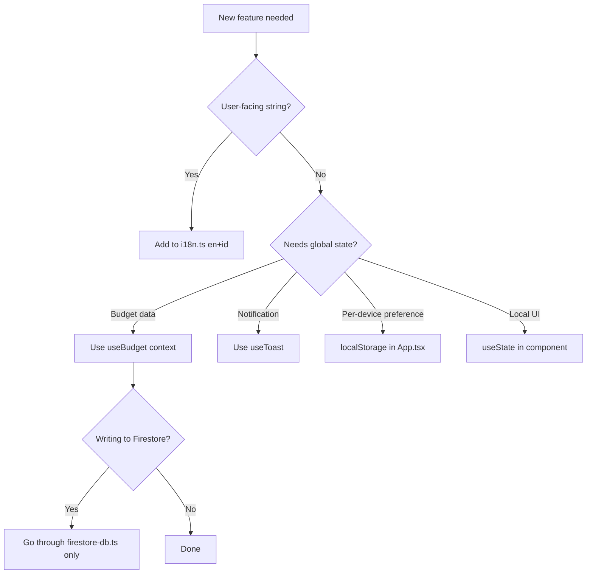

# Anti-Patterns

Patterns observed in this codebase that must NOT be introduced.

---

## 1. Direct Firebase Imports in Components

**Forbidden:**
```typescript
// In any component or page file
import { getFirestore, collection } from 'firebase/firestore'
import { getAuth } from 'firebase/auth'
```

**Why:** Bypasses the abstraction layers in `src/db/` and `src/services/`. Creates tight coupling, makes testing impossible (the Vitest mocks are wired to the module boundaries, not raw Firebase calls), and scatters Firebase logic across the codebase.

**Do instead:** Access data via `useBudget()` context. Access auth via props from `App.tsx` or `src/services/auth.ts`.

---

## 2. Using `alert()`, `confirm()`, or `console.log()`

**Forbidden:**
```typescript
alert('Budget deleted')
if (confirm('Are you sure?')) { ... }
console.log('debug:', data)
```

**Why:**
- `alert`/`confirm` block the main thread, are unstyled, and break the offline UX
- `console.log` triggers the ESLint `no-console` rule

**Do instead:**
- Notifications → `showToast(message, type)` from `useToast()`
- Confirmations → `<ConfirmModal>` component (`src/components/ConfirmModal.tsx`)
- Logging → `getLogger('Module').info(message)` from `src/utils/logger.ts`

---

## 3. Inline Styles and Arbitrary Tailwind Values

**Forbidden:**
```tsx
<div style={{ color: '#3b82f6', marginTop: 12 }} />
<div className="text-[13px] mt-[7px] bg-[#f0f0f0]" />
```

**Why:** Breaks visual consistency, bypasses the design system, and makes dark mode / theme changes harder.

**Do instead:** Use Tailwind utility classes from the design system. For conditional class merging use `cn()` from `src/utils/cn.ts`:
```tsx
<div className={cn('text-sm mt-2', isActive && 'text-blue-500')} />
```

---

## 4. Storing Display Strings in Firestore

**Forbidden:**
```typescript
// Saving the formatted string instead of the raw number
addBudget({ amount: '$1,234.56', currency: 'USD' })
```

**Why:** Display format varies by locale. IDR uses `.` as thousands separator — a stored string like `"1.234"` will be misread as `1.234` (float) when re-parsed.

**Do instead:** Always call `parseCurrencyInput(displayValue, currency)` before passing `amount` to any Firestore write function. Store `amount` as a raw `number`.

---

## 5. Hardcoded User-Facing Strings

**Forbidden:**
```tsx
<button>Add Budget</button>
<p>No budgets found. Add one to get started.</p>
```

**Why:** App supports English and Bahasa Indonesia. Hardcoded strings break the Indonesian locale entirely and require two-place changes for every copy edit.

**Do instead:** Add the key to `src/utils/i18n.ts` (both `en` and `id` objects), then use `t.yourKey` in the component.

---

## Decision Flowchart


