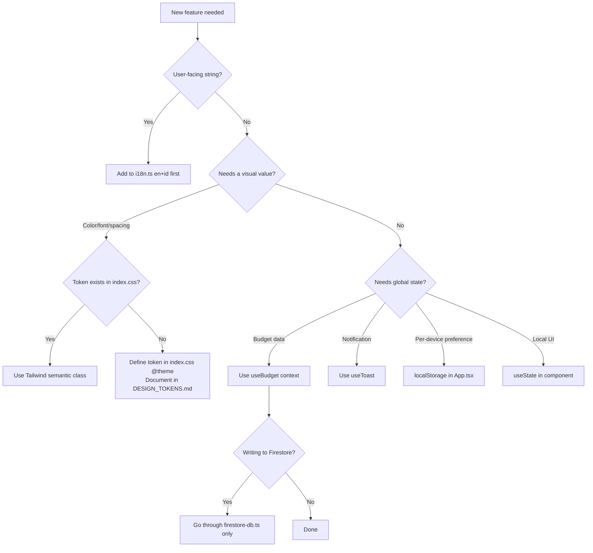

# Anti-Patterns

Patterns observed in this codebase that must NOT be introduced.

---

## 1. Direct Firebase Imports in Components

**Forbidden:**

```typescript
// In any component or page file
import { getFirestore, collection } from 'firebase/firestore'
import { getAuth } from 'firebase/auth'
```

**Why:** Bypasses the abstraction layers in `src/db/` and `src/services/`. Creates tight coupling, makes testing impossible (the Vitest mocks are wired to the module boundaries, not raw Firebase calls), and scatters Firebase logic across the codebase.

**Do instead:** Access data via `useBudget()` context. Access auth via props from `App.tsx` or `src/services/auth.ts`.

---

## 2. Using `alert()`, `confirm()`, or `console.log()`

**Forbidden:**

```typescript
alert('Budget deleted')
if (confirm('Are you sure?')) { ... }
console.log('debug:', data)
```

**Why:**

- `alert`/`confirm` block the main thread, are unstyled, and break the offline UX
- `console.log` triggers the ESLint `no-console` rule

**Do instead:**

- Notifications → `showToast(message, type)` from `useToast()`
- Confirmations → `<ConfirmModal>` component (`src/components/ConfirmModal.tsx`)
- Logging → `getLogger('Module').info(message)` from `src/utils/logger.ts`

---

## 3. Storing Display Strings in Firestore

**Forbidden:**

```typescript
// Saving the formatted string instead of the raw number
addBudget({ amount: '$1,234.56', currency: 'USD' })
```

**Why:** Display format varies by locale. IDR uses `.` as thousands separator — a stored string like `"1.234"` will be misread as `1.234` (float) when re-parsed.

**Do instead:** Always call `parseCurrencyInput(displayValue, currency)` before passing `amount` to any Firestore write function. Store `amount` as a raw `number`.

---

## 4. Hardcoded User-Facing Strings

**Forbidden:**

```tsx
<button>Add Budget</button>
<p>No budgets found. Add one to get started.</p>
```

**Why:** App supports English and Bahasa Indonesia. Hardcoded strings break the Indonesian locale entirely and require two-place changes for every copy edit.

**Do instead:** Add the key to `src/utils/i18n.ts` (both `en` and `id` objects), then use `t.yourKey` in the component.

---

## 5. Token Crime — Raw Color or Pixel Values

**Forbidden:**

```tsx
// ❌ Raw hex in className
<div className="bg-[#F2F2F7] text-[#1C1C1E]" />

// ❌ Raw hex in inline style
<div style={{ backgroundColor: '#F2F2F7', color: '#8E8E93' }} />

// ❌ Arbitrary Tailwind value that shadows an existing semantic token
<div className="bg-[#F2F2F7]" />   // --color-health-bg already covers this
```

**Why:** Raw values sever the link between intent and output. When the design evolves (dark mode, contrast theme, brand refresh), every hardcoded value must be hunted individually. Semantic tokens update globally from one place.

**Do instead:**

1. Check `src/index.css @theme` — if a semantic token exists, use it:

   ```tsx
   <div className="bg-health-bg text-health-text" />
   ```

2. If no token exists for your use case, **create it in `src/index.css @theme` first**:

   ```css
   @theme {
     --color-health-NEW: #HEXVALUE;  /* describe intent */
   }
   ```

   Then document it in `agent_docs/DESIGN_TOKENS.md` before using it.

**Permitted exception:** Dynamic `width`/`height` values computed in JavaScript for progress bars:

```tsx
style={{ width: `${Math.min(percentage, 100)}%` }}  // ✅ calculated, not hardcoded
```

---

## 6. i18n Layout Crime — Directional CSS

**Forbidden:**

```tsx
// ❌ Directional text alignment
<p className="text-left" />
<p className="text-right" />

// ❌ Directional margin/padding
<div className="ml-4 mr-2 pl-3 pr-6" />

// ❌ Directional positioning
<div className="left-0 right-4" />   // in a positioned container
```

**Why:** Directional properties are hardwired to the physical screen. They do not flip in RTL layouts (Arabic, Hebrew, Farsi, Urdu). Every directional class added today blocks future RTL locale support.

**Do instead:** Use Tailwind's logical property utilities:

| ❌ Directional | ✅ Logical |
| --- | --- |
| `text-left` | `text-start` |
| `text-right` | `text-end` |
| `ml-*` | `ms-*` |
| `mr-*` | `me-*` |
| `pl-*` | `ps-*` |
| `pr-*` | `pe-*` |
| `left-0` | `start-0` |
| `right-0` | `end-0` |

**Permitted exception:** Structural layout anchored to a physical edge of the screen that must never flip (e.g., `lg:ml-[72px]` content offset from a sidebar that is always physically left). Document each exception in `agent_docs/I18N_ARCHITECTURE.md` under "Documented RTL Exceptions."

---

## 7. Inline Styles for Static Visual Properties

**Forbidden:**

```tsx
<div style={{ color: '#3b82f6', marginTop: 12, borderRadius: 8 }} />
```

**Why:** Bypasses the token system, prevents `cn()` conflict resolution, and makes dark mode / theme changes harder. Static visual properties always have a Tailwind class or a semantic token equivalent.

**Do instead:** Use Tailwind utility classes. For conditional merging use `cn()` from `src/utils/cn.ts`:

```tsx
<div className={cn('text-indigo-600 mt-3 rounded-xl', isActive && 'bg-indigo-50')} />
```

---

## Decision Flowchart


